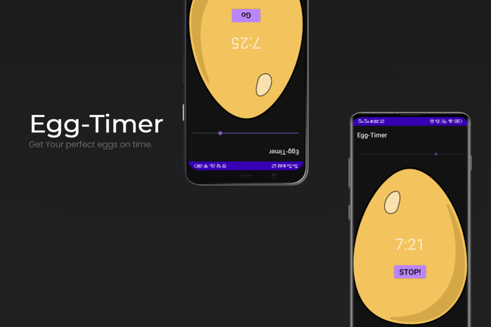

# Egg-Timer

This application is work as title suggest egg timer in this app there is timer which starts when user press start button then after pressing stop button timer set to initial position.
After completing timer to 0 music play to indicate that time is end now.

# How to run app 

 * You can just install on your android phone.
 * If it shows you an error try for install with unknown source.
 * for modify or use this app you can download zip file and after extracting it open in android studio. 

# How to run modules

 * This app only consists of one button you have to just press it and timer starts.

# Features

 * User can use this app as egg timer for making perfect eggs.
 * After completing timer it also plays sound so that user notify with sound that eggs are ready. 

## What it looks like

  
