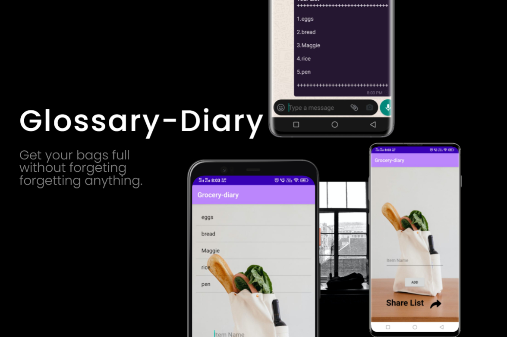

# GLOSSARY-DIARY

This application works as title suggest "glossary diary" in this app you can add items by pressing add item button and you can also submit this list of items as text file to any 
social media platform such as whatsapp,facebook and many more. 

## How to run app 

 * You can just install on your android phone.
 * If it shows you an error try for install with unknown source.
 * for modify or use this app you can download zip file and after extracting it open in android studio.

## How to run modules

 * This app only consists of one button by pressing it you can add items to list.

## Features

 * User can use this app to remember list of things for shopping.
 * User just have to write things on input box and add items to that list
 * User also able to share this shopping list to any social  media platform
  
## What it looks like

  
