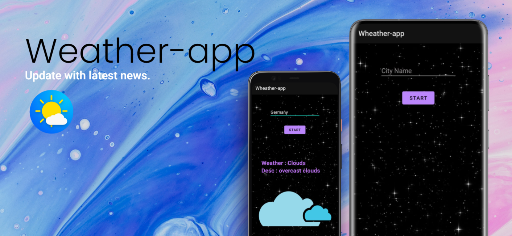

# WEATHER-APP

This application is display weather report based on the city or any location name you give as input. Api used in this app.

Api - `https://openweathermap.org/`

# How to run app 

 * You can just install on your android phone.
 * If it shows you an error try for install with unknown source.
 * for modify or use this app you can download zip file and after extracting it open in android studio. 

# How to run modules

 * In this app you have to type your city or location name in input field 
 * Just press start button and you good to go.

# Features

 * User can use this app to know about realtime current weather. 
 * The weather info is in very very simple language. 
 
 
## What it looks like

